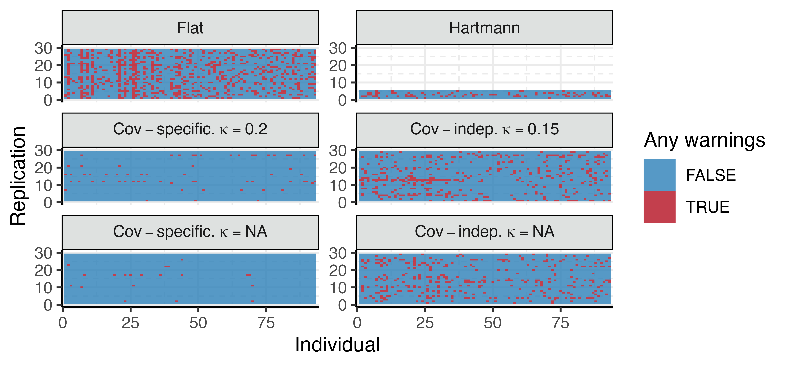
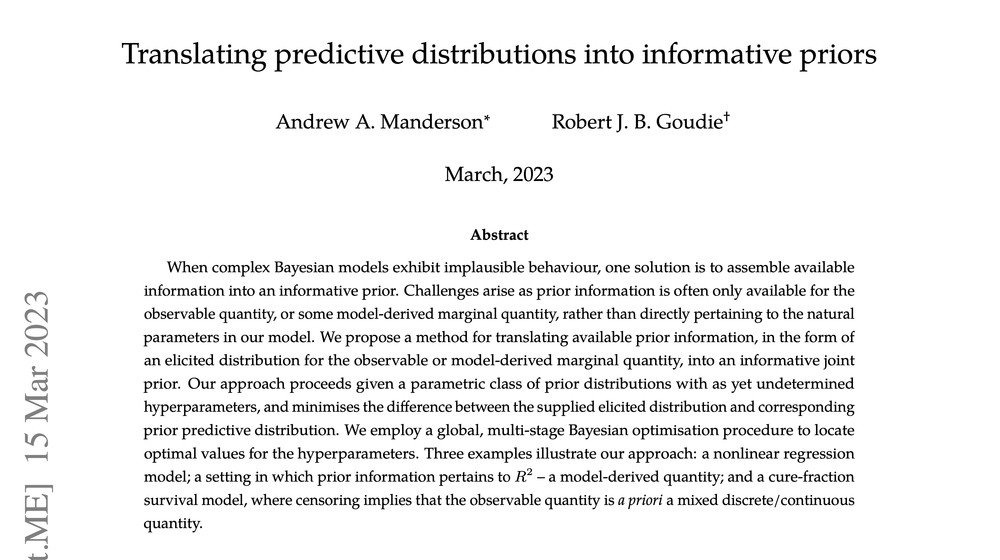

```{r setup, include = FALSE}
knitr::opts_chunk$set(echo = FALSE, comment = NA, fig.align = "center")
# Rscript -e "rmarkdown::render('slides.rmd')"
```

# An example

- You find yourself modelling height, measured in centimetres, for a uniformly random sample of 2-18 year old humans.

# The problem

- Specific: "_How do I ensure that my model roughly knows what scale these 'humans' are?_"
- General: "_How can I make my complex mathematical model aware of the phenomena to which it is being applied?_"

Relevant when the ratio of available data to model complexity is low.  

# Peaking ahead -- what do I mean by "model"

- The simplest PB model looks like this:

\begin{equation*}
  Y(t) = h_{1} - \frac{
    2(h_{1} - h_{0})
  } {
    \exp\left\{s_{0}(t - \gamma)\right\} +
    \exp\left\{s_{1}(t - \gamma)\right\}
  } +
  \varepsilon
\end{equation*}

- Not a very complex model (no where near as complex as a `resnet`/`catboost` model).
- Almost impossible to translate properties of humans that are easy to say into constraints on the parameters.

# On notation/nomenclature

\begin{equation*}
  \textcolor{myredhighlight}{Y}(t) = \textcolor{mymidblue}{h_{1}} - \frac{
    2(\textcolor{mymidblue}{h_{1}} - \textcolor{mymidblue}{h_{0}})
  } {
    \exp\left\{\textcolor{mymidblue}{s_{0}}(t - \textcolor{mymidblue}{\gamma})\right\} +
    \exp\left\{\textcolor{mymidblue}{s_{1}}(t - \textcolor{mymidblue}{\gamma})\right\}
  } +
  \varepsilon
\end{equation*}

- Data/Observable: $\textcolor{myredhighlight}{Y}$
- Parameters: $\textcolor{mymidblue}{\theta} = (\textcolor{mymidblue}{h_{0}}, \textcolor{mymidblue}{h_{1}}, \textcolor{mymidblue}{s_{0}}, \textcolor{mymidblue}{s_{1}}, \textcolor{mymidblue}{\gamma})$

# What does this actually look like

An example of our model

```{r ex_reg}
knitr::include_graphics("figures/pb-model/indiv-25.pdf")
```

# A detour into Bayesian modelling 

- When looking to including knowledge of the world (that isn't yet data) into your model, Bayesian inference is the solution.
- Any time you use probability to make statements about your belief in some eventuality, you are doing Bayesian inference.
- Mathematically nicer, computationally tooling better (so we can fit weirder models).

<!-- 
- We often unconsciously do this type of inference when we make statements about the world with probability.
-->

# Example -- forecasting height

```{r}
knitr::include_graphics("figures/pb-model/ex-bayes-forecast.pdf")
```

Bayes prediction statement: '_I am 86.4% sure that this person will be between \textcolor{mymidblue}{123.7}cm and \textcolor{mymidblue}{126.2}cm tall at age 9_'.

# Two formulas for Bayesian inference

The two key formula for Bayesian inference. The model:
\begin{equation}
  \textcolor{myredhighlight}{\pd(Y, \theta)} = \pd(Y \mid \theta) \textcolor{mymidblue}{\pd(\theta)}
\end{equation}

- Joint model: $\textcolor{myredhighlight}{\pd(Y, \theta)}$,
- Observation model / likelihood: $\pd(Y \mid \theta)$
- Prior: $\textcolor{mymidblue}{\pd(\theta)}$

# The other formula

Bayes theorem / law of conditional probability / posterior definition:
\begin{align}
  \textcolor{myredhighlight}{\pd(\theta \mid Y)} =& \,\,\frac{\pd(Y \mid \theta) \pd(\theta)}{\pd(Y)} \nonumber \\
  \textcolor{myredhighlight}{\pd(\theta \mid Y)} \mathop{\propto}& \,\,\pd(Y \mid \theta) \pd(\theta)
\end{align}

- Posterior: $\textcolor{myredhighlight}{\pd(\theta \mid Y)}$
- Names have annoying Latin origins

<!-- that you might hear lawyers, economists, and certain ex prime ministers use. -->

# Bayes vs other way (1)

**Bayes**

- Use probability to describe our certainty/belief/knowledge about the world or events therein
- Specify the whole model (observable, parameters, prior, structure) -- requires careful thought.

# Bayes vs other way (2)

**The other way**[^eurgh]

- Probability as a mathematical description of the long-run behaviour of an ideal experiment.
- Specify an estimator or likelihood, choose an optimisation method.

[^eurgh]: There is more than one other way.

# Returning to our example (1)

```{r}
knitr::include_graphics("figures/pb-model/ex-bayes-forecast.pdf")
```

Bayes prediction statement: '_I am 86.4% sure that this person's measured height will be between \textcolor{mymidblue}{123.7}cm and \textcolor{mymidblue}{126.2}cm at age 9_'.

# Returning to our example (2)

In a frequentist framework:

- Specify estimator for the mean (maybe use the same model + Gaussian likelihood)
  - Derive its sampling distribution (or bootstrap)
- Need an estimator for the noise
- Do maths to combine the two estimators -- not always trivial or possible.

# Returning to our example (2)

Our frequentist can then make statements like:

- "_I am 86.4% confident that, in future replications of this experiment, a person with these measurements will have a measured height of between \textcolor{mymidblue}{123.7}cm and \textcolor{mymidblue}{126.2}cm at age 9_."

# Typical questions addressed (1)

**Bayes**

- Can we coherently incorporate other published information/results into our model? 
- Can we produce a distributional forecast for our complex ODE/PDE model, which itself uses 3 different data sources?
- Can we fit models with hierarchical structure whilst being explicit about the relationship between exchangeable units?

# Typical questions addressed (1)

**The other way**

- Are our forecasts nominally calibrated?
- Under an ideal set of assumptions, how many people do we need to test our new drug on to see if it is safe/effective?

There are elements of both in any analysis / experiment (you can probably answer any question with any approach given enough coffee and compute).

# Back to our problem

- Specific: "_How do I ensure that my model roughly knows what scale these 'humans' are?_"
- Conduct an elicitation [@tversky_judgment_1974; @ohagan_uncertain_2006].
- We are interested in the following step, translation of elicited information into a prior $\textcolor{mymidblue}{\pd(\theta)}$.

# Possible prior predictive

Elicited prior predictive density $\textcolor{myredhighlight}{\text{t}(Y)} =$

```{r ppd_one}
knitr::include_graphics("figures/pb-model/pop-target-marginal.pdf")
```

# Model (1)

- "_The Preece-Baines model is a standard model for this kind of data_"

\begin{equation*}
  Y(t) = h_{1} - \frac{
    2(h_{1} - h_{0})
  } {
    \exp\left\{s_{0}(t - \gamma)\right\} +
    \exp\left\{s_{1}(t - \gamma)\right\}
  } + \varepsilon
\end{equation*}

# Model (2)

\begin{equation*}
  Y(t) = h_{1} - \frac{
    2(h_{1} - h_{0})
  } {
    \exp\left\{s_{0}(t - \gamma)\right\} + 
    \exp\left\{s_{1}(t - \gamma)\right\}
  } + \varepsilon
\end{equation*}

- How should you "translate" $\textcolor{myredhighlight}{\text{t}(Y)}$ into a joint prior for $\theta = (h_{1}, h_{0}, s_{0}, s_{1}, \gamma)$?
- Best practice is _painful_ (especially for more complex models)

# General idea (1)

- Pick hyperparameters $\lambda$ of prior $\pd(\theta \mid \lambda)$ by minimising some discrepancy

\begin{equation*}
  D(\lambda) = \int d\left(
  \textcolor{blues2}{\pd(Y \mid \lambda)}, \textcolor{myredhighlight}{\text{t}(Y)}\right) \text{d}Y
\end{equation*}

- Solution $\lambda^{*} = \min\limits_{\lambda \in \Lambda} D(\lambda)$
- Known class of problems, generally not unique as written.

# General idea (2)

Solution $\textcolor{blues2}{\pd(Y \mid \lambda^{*})}$ and target $\textcolor{myredhighlight}{\text{t}(Y)}$:

```{r process, out.width = "80%"}
knitr::include_graphics("figures/tuning-parameters/idealised-process.pdf")
```

# Challenges

- Optimisation surface
- Numerics
- Inherent, irreducible noise
- Underspecification / multiple solutions.

# Partial solutions

We can partly address these issues:

- Two-stage, multi-objective, gradient-free global optimisation
- Careful numerical implementation and importance sampling (numerical integration)
- Surrogate objectives (Bayesian optimisation) for compute-efficient optimisation.
- `R` package implementation with few requirements for users: [\textcolor{blue}{gitlab.com/andrew-manderson/pbbo}](https://gitlab.com/andrew-manderson/pbbo)

# Highlights from the results (1)

What information have we imbued into the model?:

```{r regression_results, out.width = "80%"}
knitr::include_graphics("figures/preece-baines-growth/regression-prior-preds.pdf")
```

# Highlights from the results (1)

Practically, does it make our computation better?:

```{r warnings_results, out.width = "80%"}

```

<!-- # Fun open questions

- Can we actually ever address nonuniqueness in this problem?
- Can we derive some new maths that yields an interesting gradient in discrete and mixed discrete-continuous settings?
- Can we build a useful/fast interface for this so people actually use it?
 -->
# Paper

```{r paper_screenshot, out.height = "60%"}

```

[\textcolor{blue}{Paper (arXiv)}](https://arxiv.org/abs/2303.08528), [\textcolor{blue}{Project (GitLab)}](https://gitlab.com/andrew-manderson/pbbo-paper)

# Bibliography {.allowframebreaks}
